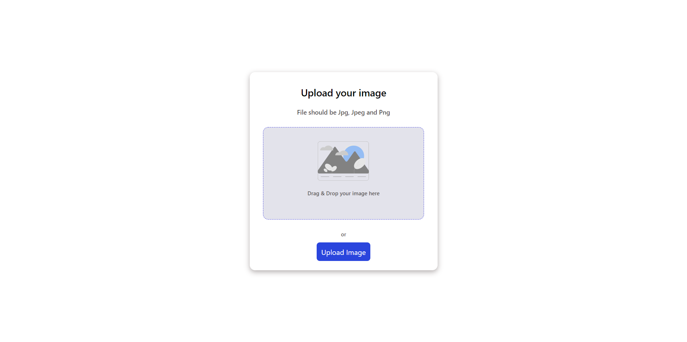
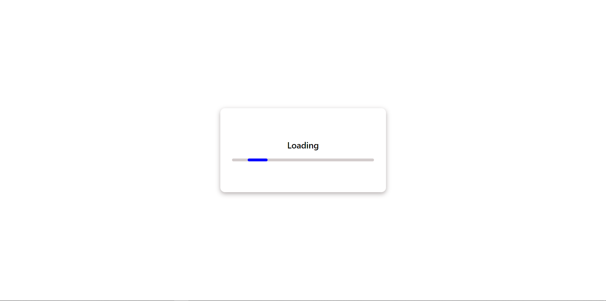
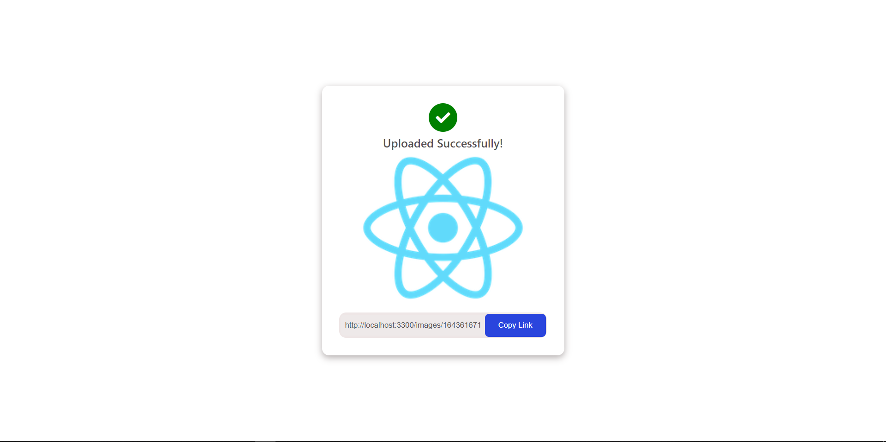

# Image Uploader

Upload Images directly to Server 

* Upload Images
* Drag and Drop 
* Generates unique url for each image

# Home Page 




# Loading 




# Image Preview 




# Tech Stack 
 Front-End :

* ReactJS
* Context API

You can Find Client Code [Here](https://github.com/0xdevsachin/image-uploader-client)

Back-End : 

* NodeJS
* ExpressJS
* Multer


# Development Setup

```shell
# Clone this repository
git clone https://github.com/0xdevsachin/image-uploader-server.git

# Install dependencies
$ npm install

# Run the app
$ npm start
```

# Available Routes

* Get  "/ " To check if Server is Up
* Post "/uploads" To upload Images